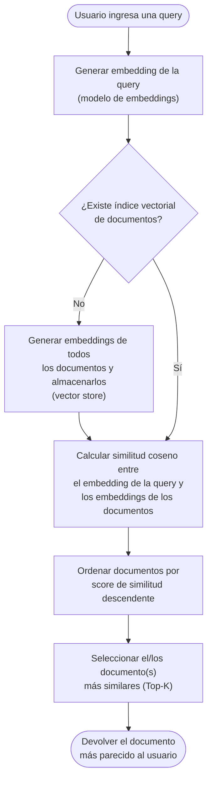

# Ejercicio: Similitud Semántica vs. Coincidencia de Palabras Clave

> **Nota:** Este no es el entregable final de la unidad, es solamente un ejercicio de análisis y diseño sobre la capacidad de los modelos de embeddings para discernir relevancia semántica.

## 1. Objetivo

Evaluar la capacidad de un modelo de embeddings para diferenciar entre:

- **Relevancia semántica real**: oraciones que hablan del mismo concepto técnico con vocabulario distinto (deberían tener alta similitud coseno).
- **Coincidencia superficial de palabras clave**: oraciones que comparten términos léxicos pero no el significado (deberían tener baja similitud coseno pese a compartir palabras).

Concepto técnico elegido: **Despliegue de microservicios**.

## 2. Conjunto de oraciones

### 2.1 Oraciones semánticamente relevantes (mismo concepto, vocabulario distinto)

| # | Oración | Vocabulario clave |
|---|---------|--------------------|
| 1 | "Publicamos cada componente de la aplicación de forma independiente en contenedores dentro del clúster de Kubernetes." | contenedores, clúster, Kubernetes |
| 2 | "El equipo automatizó la entrega continua de los servicios distribuidos mediante pipelines de CI/CD hacia el entorno productivo." | CI/CD, pipelines, productivo |
| 3 | "Cada módulo del sistema se empaqueta como una imagen Docker y se libera de manera autónoma sin afectar a los demás." | Docker, imagen, autónoma |
| 4 | "La orquestación de los servicios se realiza escalando réplicas dinámicamente según la demanda en la nube." | orquestación, réplicas, escalado |
| 5 | "Lanzamos versiones nuevas de cada microservicio usando estrategias de rollout progresivo (canary) sin downtime." | rollout, canary, downtime |

### 2.2 Oraciones trampa (comparten palabras clave, significado opuesto o irrelevante)

| # | Oración | Motivo de la trampa |
|---|---------|----------------------|
| T1 | "El servicio de micro-limpieza es excelente y llega puntual todos los martes a la oficina." | Comparte el prefijo "micro-" y la palabra "servicio", pero no tiene relación con software. |
| T2 | "El despliegue de las tropas se realizó en la frontera tras la orden del comando militar." | Comparte la palabra "despliegue", pero el contexto es militar, no técnico. |

### 2.3 Resultado esperado

Un buen modelo de embeddings debería producir:

- Similitud coseno **alta** (≈ 0.6 - 0.9) entre las oraciones 1-5 entre sí.
- Similitud coseno **baja** (≈ 0.0 - 0.3) entre las oraciones 1-5 y las oraciones trampa T1/T2, a pesar de la coincidencia léxica parcial ("micro-", "despliegue").

Esto demuestra que el modelo captura el **significado contextual** y no solo la superposición de tokens, a diferencia de un enfoque léxico (ej. TF-IDF o coincidencia exacta de palabras).

## 3. Cálculo de Similitud Coseno con `scikit-learn`

`scikit-learn` provee la función [`cosine_similarity`](https://scikit-learn.org/stable/modules/generated/sklearn.metrics.pairwise.cosine_similarity.html) dentro de `sklearn.metrics.pairwise`, que recibe matrices de vectores (embeddings) y devuelve la matriz de similitudes por pares.

La fórmula matemática de la similitud coseno entre dos vectores $A$ y $B$ es:

$$
\text{cos\_sim}(A, B) = \frac{A \cdot B}{\lVert A \rVert \, \lVert B \rVert} = \frac{\sum_{i=1}^{n} A_i B_i}{\sqrt{\sum_{i=1}^{n} A_i^2} \, \sqrt{\sum_{i=1}^{n} B_i^2}}
$$

El resultado va de -1 (opuestos) a 1 (idénticos en dirección), siendo 0 la ortogonalidad (sin relación).

### 3.1 Ejemplo en Python

```python
"""
Ejemplo: cálculo de similitud coseno entre embeddings de oraciones
usando scikit-learn.

Requisitos:
    pip install scikit-learn openai  # o el proveedor de embeddings que se use
"""

from sklearn.metrics.pairwise import cosine_similarity
import numpy as np

# 1. Supongamos que ya generamos los embeddings con un modelo
#    (ej. OpenAI "text-embedding-3-small", Cohere, HuggingFace, etc.)
#    Cada embedding es un vector de floats de dimensión fija (ej. 1536).
embedding_oracion_1 = np.array([[0.12, 0.08, -0.03, ...]])  # vector oración 1
embedding_oracion_2 = np.array([[0.11, 0.07, -0.02, ...]])  # vector oración 2

# 2. Calculamos la similitud coseno entre ambos vectores
similitud = cosine_similarity(embedding_oracion_1, embedding_oracion_2)

print(f"Similitud coseno: {similitud[0][0]:.4f}")


# 3. Ejemplo aplicado: comparar una oración base contra un conjunto de candidatas
def obtener_embedding(texto: str) -> list[float]:
    """
    Placeholder: aquí se llamaría al proveedor real
    (ej. client.embeddings.create(model="text-embedding-3-small", input=texto)).
    """
    ...


oracion_base = "Publicamos cada componente de la aplicación en contenedores dentro de Kubernetes."
candidatas = [
    "El equipo automatizó la entrega continua de los servicios distribuidos mediante CI/CD.",
    "El servicio de micro-limpieza es excelente y llega puntual todos los martes.",
]

vector_base = np.array([obtener_embedding(oracion_base)])
vectores_candidatas = np.array([obtener_embedding(c) for c in candidatas])

similitudes = cosine_similarity(vector_base, vectores_candidatas)

for oracion, score in zip(candidatas, similitudes[0]):
    print(f"[{score:.4f}] {oracion}")
```

### 3.2 Notas de implementación

- `cosine_similarity` acepta matrices de forma `(n_muestras, n_dimensiones)`, por lo que un solo vector debe pasarse como `[[...]]` (matriz de 1 fila) o usando `.reshape(1, -1)`.
- Para comparar una query contra muchos documentos (búsqueda semántica), conviene calcular todos los embeddings de los documentos una sola vez y guardarlos en una matriz `(n_documentos, n_dimensiones)`; luego se compara contra el vector de la query en una sola llamada vectorizada.
- Si los embeddings ya están normalizados (norma L2 = 1), la similitud coseno equivale al producto punto simple, lo cual es más rápido de calcular.

## 4. Diagrama de flujo: proceso de búsqueda semántica



## 5. Conclusión

El ejercicio evidencia que la similitud coseno sobre embeddings permite capturar relevancia semántica real: las oraciones 1-5 —pese a no compartir vocabulario— deberían agruparse por significado, mientras que las oraciones trampa T1/T2 —pese a compartir palabras— deberían quedar claramente separadas por score bajo. Esta es la base conceptual de los sistemas de búsqueda semántica (RAG, recuperación de documentos, etc.), que superan las limitaciones de la búsqueda léxica tradicional (keyword matching).
